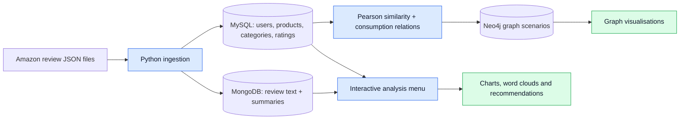
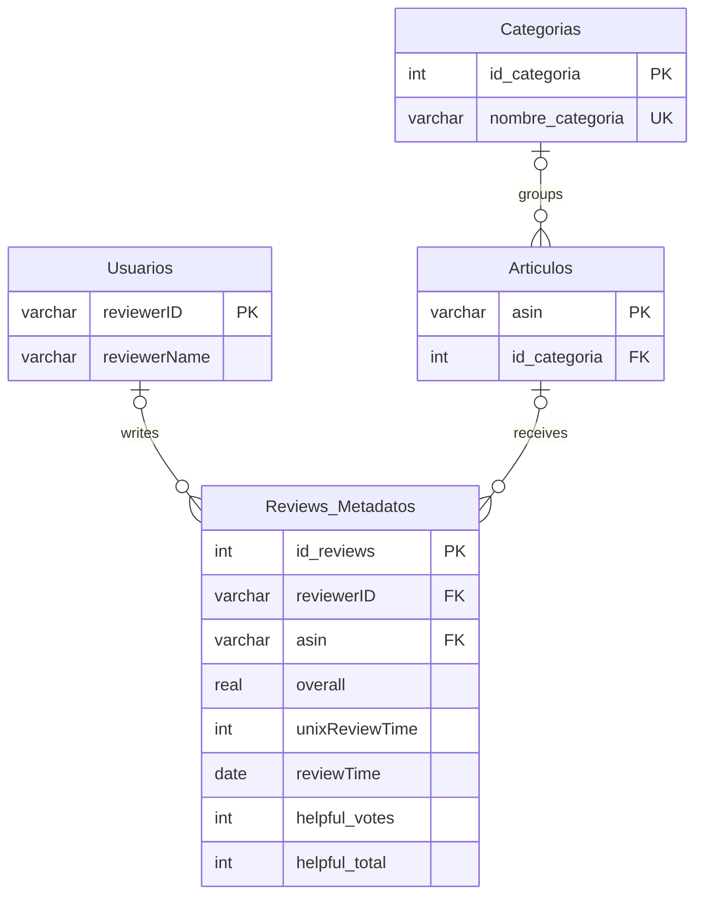

# Amazon Reviews Analysis with MySQL, MongoDB and Neo4j


**One reviews dataset, three database models: structured metadata, review documents and user/product graphs.**

Academic project by **Miguel Pajuelo Gómez and Jorge Ois de Pascual** for *Bases de Datos*, ICAI, Universidad Pontificia Comillas. Python coordinates ingestion, cross-database queries, visual analysis and a simple popularity-based recommendation workflow.

[Architecture](#architecture) · [Data model](#relational-data-model) · [Setup](#setup) · [Execution](#execution) · [Report](documentacion/memoria.pdf)

## What the project demonstrates

- **Data modelling:** choosing relational tables, document storage and graph relationships for different parts of the same domain.
- **ETL in Python:** reading line-delimited review JSON, normalising metadata and batching review texts into MongoDB.
- **SQL and graph analysis:** joining users and products, calculating user similarity with Pearson correlation and exploring consumption relationships.
- **Visual exploration:** review activity over time, ratings, popular products, word clouds and graph visualisations.

## Architecture



MySQL stores structured entities and ratings; MongoDB stores review text and summaries with `reviewerID` and `asin` for application-level lookups. Neo4j graphs are built from MySQL query results. This is an academic integration, without a distributed transaction layer across the three services.

## Relational data model

The following diagram follows the tables and foreign keys created in [`load_data.py`](load_data.py). Foreign-key columns are nullable in the original schema.



## Repository guide

| Module | Responsibility |
|---|---|
| [configuracion.py](configuracion.py) | Database connection settings and portable dataset paths. |
| [load_data.py](load_data.py) | Schema creation and ingestion of four main review categories. |
| [insertar_dataset.py](insertar_dataset.py) | Ingestion of seven additional categories. |
| [menu_visualizacion.py](menu_visualizacion.py) | Interactive SQL/document analysis, charts and recommendations. |
| [neo4JProyecto.py](neo4JProyecto.py) | Pearson similarity, user/product/category graphs and visualisation. |
| [Dataset instructions](datos/README.md) | Expected files and the historical Amazon review format. |
| [Report](documentacion/memoria.pdf) / [Poster](documentacion/poster.pdf) | Original submission and proposed extensions. |

## Setup

You need Python and accessible **MySQL, MongoDB and Neo4j** services. The repository does not bundle or automatically start database servers.

### 1. Install Python dependencies

PowerShell, from this directory:

```powershell
python -m venv .venv
.\.venv\Scripts\python.exe -m pip install -r requirements.txt
```

On Linux/macOS, use `.venv/bin/python` instead of `.\.venv\Scripts\python.exe` in the commands below.

### 2. Configure connections and data

Use [.env.example](.env.example) as the complete reference. Variables must be exported in the shell; the file is not read automatically. PowerShell example:

```powershell
$env:MYSQL_USER = "YOUR_MYSQL_USER"
$env:MYSQL_PASSWORD = "YOUR_LOCAL_MYSQL_PASSWORD"
$env:NEO4J_PASSWORD = "YOUR_LOCAL_NEO4J_PASSWORD"
$env:BBDD_DATA_DIR = "C:\absolute\path\to\review_datasets"
```

| Service | Default configuration |
|---|---|
| MySQL | `127.0.0.1:3306`, database `amazon_reviews`; user needs schema/data creation permissions. |
| MongoDB | `mongodb://127.0.0.1:27017/`, database `amazon_reviews`, collection `reviews`. |
| Neo4j | `bolt://127.0.0.1:7687`, database `neo4j`; use a dedicated exercise database/instance. |

Prepare the eleven dataset files described in [datos/README.md](datos/README.md). The code expects the historical **5-core Amazon reviews format**, not Amazon 2023. Large JSON files and local passwords are excluded from Git.

## Execution

With the services running, use databases dedicated to this project. Load the main categories **once into empty databases**:

```powershell
.\.venv\Scripts\python.exe load_data.py
.\.venv\Scripts\python.exe menu_visualizacion.py
```

To add the supplementary categories:

```powershell
.\.venv\Scripts\python.exe insertar_dataset.py
```

To run the interactive graph scenarios:

```powershell
.\.venv\Scripts\python.exe neo4JProyecto.py
```

**Database behaviour to know:** repeated ingestion does not deduplicate review records. Each Neo4j scenario calls `limpiar_neo4j`, deleting all nodes and relationships in the selected graph database before rebuilding it. Use a dedicated instance/database. Generated figures are written to `imagenes/`, which is excluded from Git.

## Implemented analysis and scope

| Implemented in the selected code | Discussed as future extensions in the report |
|---|---|
| SQL aggregations and document-backed word clouds. | A trained matrix-factorisation recommendation model. |
| Pearson user similarities and consumption graphs. | A complete collaborative-filtering evaluation pipeline. |
| Popularity-based suggestions excluding consumed items. | Benchmark metrics for recommendation quality. |

The diagrams above describe the code and schema; they are not charts from a newly executed database experiment. Configuration and ingestion logic were checked locally with a synthetic record and simulated connectors. No live MySQL/MongoDB/Neo4j loading or new result figures were produced during preparation.

The original loader retains limitations in repeat loads and exception handling, including references to `conn` before connection creation in some error paths. See [VALIDACION.md](VALIDACION.md) for the precise checks and [PROCEDENCIA.md](PROCEDENCIA.md) for the selected versions and portability changes.
